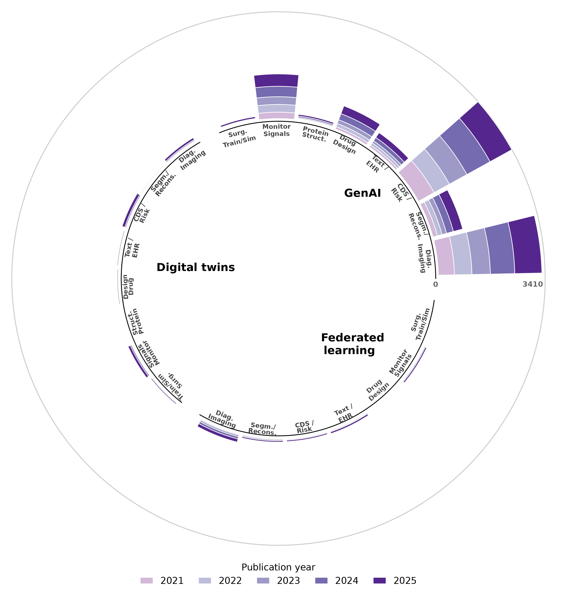

# Web scraping PubMed for GenAI, Digital Twins, and Federated Learning in Biomedical Applications



This repository contains a reproducible workflow to:
- Automatically query **PubMed** for publications related to  
  **Generative AI (GenAI)**, **Digital Twins (DT)**, and **Federated Learning (FL)**  
- Count the number of papers per **biomedical application domain** and **year**
- Aggregate the results into a CSV file
- Generate publication trend visualizations, including a **circular plot** and **faceted line plots**.

The analysis is used to explore how these emerging computational paradigms are being adopted across key biomedical use cases.

---

## 🔍 What this project does

The workflow focuses on three technological topics:

- Generative AI (GenAI)  
- Digital Twins (DT)  
- Federated Learning (FL)  

across eight biomedical application domains:

1. Diagnostic imaging (classification/detection)  
2. Imaging segmentation / reconstruction  
3. Clinical decision support & risk prediction  
4. Clinical text / electronic health record (EHR) modelling  
5. Drug discovery & design  
6. Protein / biomolecule structure  
7. Patient monitoring & physiological signals  
8. Surgical planning / training & simulation  

For each **topic–application–year** combination (e.g. *GenAI + drug discovery + 2023*), the notebook:

1. Constructs a PubMed search query  
2. Retrieves the corresponding HTML page  
3. Parses the number of indexed publications  
4. Stores the results in a structured table (`.csv`)  
5. Uses this table to generate summary plots.

---

## 📁 Repository structure

Typical contents of this repository:

- `*.ipynb`  
  Jupyter / Google Colab notebook with the full scraping and analysis pipeline.

- `genai_topics_applications_counts_pubmed.csv`  
  Aggregated publication counts by topic, application, and year (output of the scraping stage).

- `images/`  
  - `genai_topics_applications_circularplot_pubmed-fixed_page-0001.jpg`  
    Circular plot showing the global distribution of publications across topics and applications.
  - (optional) other figures, e.g. faceted line plots of yearly trends.

You can adapt file names as needed, but make sure the paths match the ones used in your notebook and README.

---

## 🛠 Dependencies

The notebook uses standard Python data and web libraries:

- `requests` – for HTTP requests to PubMed  
- `beautifulsoup4` – for HTML parsing  
- `pandas` – for tabular data handling  
- `numpy` – for numerical operations  
- `matplotlib` – for plotting  

Install them with:

```bash
pip install requests beautifulsoup4 pandas numpy matplotlib
